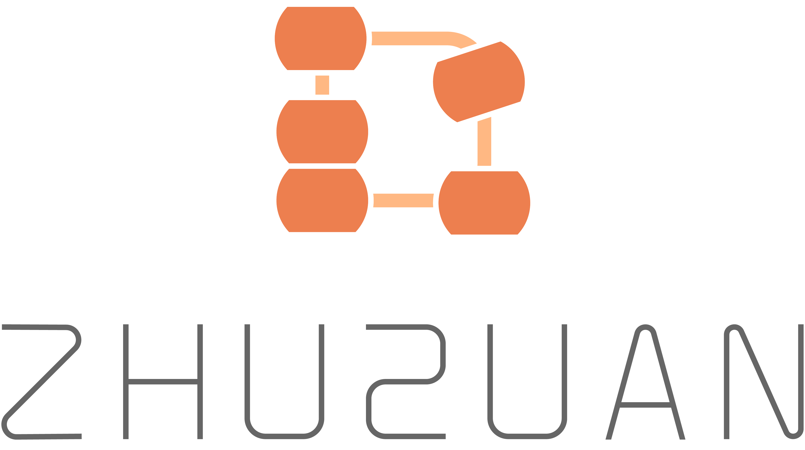

<div align="center">
  <a href="http://zhusuan.readthedocs.io"> </a>
</div>

---

[](https://travis-ci.org/thu-ml/zhusuan)
[](http://zhusuan.readthedocs.io/en/latest/?badge=latest)
[](https://github.com/thu-ml/zhusuan/blob/master/LICENSE)
[](https://gitter.im/thu-ml/zhusuan?utm_source=badge&utm_medium=badge&utm_campaign=pr-badge&utm_content=badge)

**ZhuSuan** is a Python probabilistic programming library for Bayesian deep
learning, which conjoins the complimentary advantages of Bayesian methods and
deep learning. ZhuSuan is built upon
[TensorFlow](https://www.tensorflow.org). Unlike existing deep
learning libraries, which are mainly designed for deterministic neural
networks and supervised tasks, ZhuSuan provides deep learning style primitives
and algorithms for building probabilistic models and applying Bayesian
inference. The supported inference algorithms include:

* **Variational Inference (VI)** with programmable variational posteriors, various
  objectives and advanced gradient estimators (SGVB, REINFORCE, VIMCO, etc.).

* **Importance Sampling (IS)** for learning and evaluating models, with programmable
  proposals.

* **Hamiltonian Monte Carlo (HMC)** with parallel chains, and optional
  automatic parameter tuning.

* **Stochastic Gradient Markov Chain Monte Carlo (SGMCMC)**:
  SGLD, PSGLD, SGHMC, and SGNHT.

## Installation

ZhuSuan is still under development. Before the first stable release (1.0),
please clone the repository and run
```
pip install .
```
in the main directory. This will install ZhuSuan and its dependencies
automatically. ZhuSuan also requires **TensorFlow 1.13.0 or later**. Because
users should choose whether to install the cpu or gpu version of TensorFlow,
we do not include it in the dependencies. See
[Installing TensorFlow](https://www.tensorflow.org/install/).

If you are developing ZhuSuan, you may want to install in an
"editable" or "develop" mode. Please refer to the Contributing section below.

## Documentation

* [Tutorials and API docs](http://zhusuan.readthedocs.io)
* [ZhuSuan's white paper](https://arxiv.org/abs/1709.05870)

## Examples

We provide examples on traditional hierarchical Bayesian models and recent
deep generative models.

To run the provided examples, you may need extra dependencies to be installed.
This can be done by
```
pip install ".[examples]"
```
* Gaussian: 
  [HMC](examples/toy_examples/gaussian.py)
* Toy 2D Intractable Posterior:
  [SGVB](examples/toy_examples/toy2d_intractable.py)
* Bayesian Neural Networks:
  [SGVB](examples/bayesian_neural_nets/bnn_vi.py),
  [SGMCMC](examples/bayesian_neural_nets/bnn_sgmcmc.py)
* Variational Autoencoder (VAE):
  [SGVB](examples/variational_autoencoders/vae.py),
  [IWAE](examples/variational_autoencoders/iwae.py)
* Convolutional VAE:
  [SGVB](examples/variational_autoencoders/vae_conv.py)
* Semi-supervised VAE (Kingma, 2014):
  [SGVB](examples/semi_supervised_vae/vae_ssl.py),
  [Adaptive IS](examples/semi_supervised_vae/vae_ssl_adaptive_is.py)
* Deep Sigmoid Belief Networks
  [Adaptive IS](examples/sigmoid_belief_nets/sbn_adaptive_is.py),
  [VIMCO](examples/sigmoid_belief_nets/sbn_vimco.py)
* Logistic Normal Topic Model:
  [HMC](examples/topic_models/lntm_mcem.py)
* Probabilistic Matrix Factorization:
  [HMC](examples/probabilistic_matrix_factorization/pmf_hmc.py)
* Sparse Variational Gaussian Process:
  [SGVB](examples/gaussian_process/svgp.py)

## Citing ZhuSuan

If you find ZhuSuan useful, please cite it in your publications.
We provide a BibTeX entry of the ZhuSuan white paper below.
```
@ARTICLE{zhusuan2017,
    title={Zhu{S}uan: A Library for {B}ayesian Deep Learning},
    author={Shi, Jiaxin and Chen, Jianfei. and Zhu, Jun and Sun, Shengyang
    and Luo, Yucen and Gu, Yihong and Zhou, Yuhao},
    journal={arXiv preprint arXiv:1709.05870},
    year=2017,
}
```

## Contributing

We always welcome contributions to help make ZhuSuan better. If you would like 
to contribute, please check out the guidelines [here](CONTRIBUTING.md).
