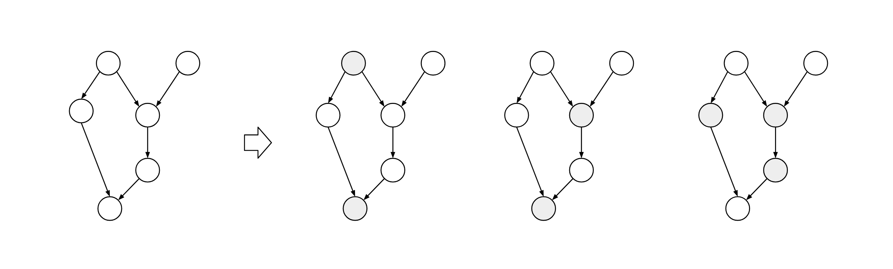

.. ZhuSuan documentation master file, created by
   sphinx-quickstart on Wed Feb  8 15:01:57 2017.
   You can adapt this file completely to your liking, but it should at least
   contain the root `toctree` directive.

Welcome to ZhuSuan
==================

ZhuSuan is a python probabilistic programming library for
**Bayesian deep learning**, which conjoins the complimentary advantages of
Bayesian methods and deep learning. ZhuSuan is built upon
`Tensorflow <https://www.tensorflow.org>`_. Unlike existing deep learning
libraries, which are mainly designed for deterministic neural networks and
supervised tasks, ZhuSuan provides deep learning style primitives and
algorithms for building probabilistic models and applying Bayesian inference.
The supported inference algorithms include:

* Variational inference with programmable variational posteriors, various
  objectives and advanced gradient estimators (SGVB, REINFORCE, VIMCO, etc.).
* Importance sampling for learning and evaluating models, with programmable
  proposals.
* Hamiltonian Monte Carlo (HMC) with parallel chains, and optional automatic
  parameter tuning.

.. toctree::
   :maxdepth: 2

Installation
------------

ZhuSuan is still under development. Before the first stable release (1.0),
please clone the `GitHub repository <https://github.com/thu-ml/zhusuan>`_ and
run
::

   pip install .

in the main directory. This will install ZhuSuan and its dependencies
automatically. ZhuSuan also requires Tensorflow version 1.13.0 or later. Because
users should choose whether to install the cpu or gpu version of Tensorflow,
we do not include it in the dependencies. See
`Installing Tensorflow <https://www.tensorflow.org/install/>`_.

If you are developing ZhuSuan, you may want to install in an "editable" or
"develop" mode. Please refer to the Contributing section in
`README <https://github.com/thu-ml/zhusuan/blob/master/README.md#contribution>`_.

After installation, open your python console and type::

   >>> import zhusuan as zs

If no error occurs, you've successfully installed ZhuSuan.

.. toctree::
   :maxdepth: 1
   :caption: Tutorials

   Tutorial slides <https://docs.google.com/presentation/d/1Xqi-qFHciAdV9z1FHpGkUcHT-yugNVzwGX3MM74rMuM/edit?usp=sharing>
   tutorials/vae
   tutorials/concepts
   tutorials/bayesian_nn
   tutorials/lntm

.. toctree::
   :maxdepth: 1
   :caption: API Docs

   api/zhusuan.distributions
   api/zhusuan.framework
   api/zhusuan.variational
   api/zhusuan.hmc
   api/zhusuan.evaluation
   api/zhusuan.transform
   api/zhusuan.diagnostics
   api/zhusuan.utils
   api/zhusuan.legacy

.. toctree::
   :maxdepth: 1
   :caption: Community

   contributing

Indices and tables
------------------

* :ref:`genindex`
* :ref:`modindex`
* :ref:`search`
