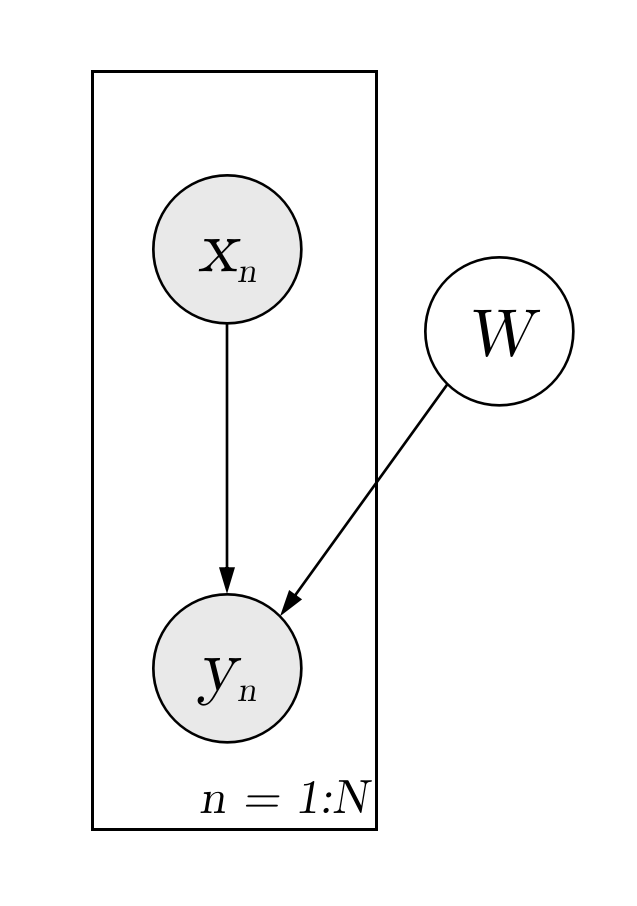

Bayesian Neural Networks for Regression
=======================================

.. note::

    This tutorial assumes that readers have been familiar with ZhuSuan's
    :doc:`Basic Concepts <concepts>`.

Recent years have seen neural networks' powerful abilities in fitting complex
transformations, with successful applications on speech recognition, image
classification, and machine translation, etc. However, typical training of
neural networks requires lots of labeled data to control the risk of
overfitting. And the problem becomes harder when it comes to real world
regression tasks. These tasks often have smaller training data to use,
and the high-frequency characteristics of these data often makes neural
networks easier to get trapped in overfitting.

A principled approach for solving this problem is **Bayesian Neural Networks**
(BayesianNN). In BayesianNN, prior distributions are put upon the neural
network's weights to consider the modeling uncertainty. By doing Bayesian
inference on the weights, one can learn a predictor which both fits to the
training data and knows about the uncertainty of its own prediction on test
data. In this tutorial, we show how to implement BayesianNN in ZhuSuan.
The full script for this tutorial is at
`examples/bayesian_neural_nets/bayesian_nn.py <https://github.com/thu-ml/zhusuan/blob/master/examples/bayesian_neural_nets/bayesian_nn.py>`_.

We use a regression dataset called
`Boston housing <https://archive.ics.uci.edu/ml/machine-learning-databases/housing/>`_.
This has :math:`N = 506` data points, with :math:`D = 13` dimensions.
The forwarding process of a BayesianNN for modeling multivariate regression is
as follows:

.. math::

    W_i &\sim \mathrm{N}(W_i|0, I),\quad i=1\cdots L. \\
    y_{mean} &= f_{NN}(x, \{W_i\}_{i=1}^L) \\
    y &\sim \mathrm{N}(y|y_{mean}, \sigma^2)

This forwarding process starts with a input features (:math:`x`), then
:math:`x` is forwarded through a deep neural network (:math:`f_{NN}`)
with :math:`L` layers, whose parameters in each layer satisfy a factorized
multivariate standard Normal distribution. With this complex forwarding
process, the model is enabled to learn complex relationships between the
input (:math:`x`) and the output (:math:`y`). Finally, some noise is added to
the output to get a tractable likelihood for the model, which is typically
a Gaussian noise in regression problems. A graphical model representation for
bayesian neural network is as follows. Combining the observed input (:math:`x`) and
the global network parameters (:math:`\{W_i\}_{i=1}^L`), the model outputs
observed (:math:`y`).

Build the Model
---------------

Following the forwarding process, first we need standard Normal
distributions to generate the weights (:math:`\{W_i\}_{i=1}^L`).
For a layer with ``n_in`` input units and ``n_out`` output units, the weights
are of shape ``[n_out, n_in + 1]`` (one additional column for bias).
As presented in our graphical model, the latent variable of weights are global
for all the data. So we need only one copy of them, that is, we need a
:class:`~zhusuan.model.stochastic.Normal` StochasticTensor of shape
``[1, n_out, n_in + 1]``::

    with zs.BayesianNet(observed=observed) as model:
        ws = []
        for i, (n_in, n_out) in enumerate(zip(layer_sizes[:-1],
                                              layer_sizes[1:])):
            w_mu = tf.zeros([1, n_out, n_in + 1])
            ws.append(
                zs.Normal('w' + str(i), w_mu, std=1.,
                          n_samples=n_particles, group_ndims=2))

To treat the weights in each layer as a whole and evaluate the probability of
them together, ``group_ndims`` is set to 2. If you are unfamiliar with this
property, see :ref:`dist-and-stochastic`.

Then we write the feedforward process of neural networks, through which the
connection between output ``y`` and input ``x`` is established::

    with zs.BayesianNet(observed=observed) as model:
        ...
        # forward
        ly_x = tf.expand_dims(
            tf.tile(tf.expand_dims(x, 0), [n_particles, 1, 1]), 3)
        for i in range(len(ws)):
            w = tf.tile(ws[i], [1, tf.shape(x)[0], 1, 1])
            ly_x = tf.concat(
                [ly_x, tf.ones([n_particles, tf.shape(x)[0], 1, 1])], 2)
            ly_x = tf.matmul(w, ly_x) / \
                tf.sqrt(tf.to_float(tf.shape(ly_x)[2]))
            if i < len(ws) - 1:
                ly_x = tf.nn.relu(ly_x)

Next, we add an observation distribution (noise) to get a tractable
likelihood when evaluating the probability::

    with zs.BayesianNet(observed=observed) as model:
        ...
        y_mean = tf.squeeze(ly_x, [2, 3])
        y_logstd = tf.get_variable(
            'y_logstd', shape=[],
            initializer=tf.constant_initializer(0.))
        y = zs.Normal('y', y_mean, logstd=y_logstd)

Putting together and adding model reuse, the code for constructing a BayesianNN is::

    import tensorflow as tf
    import zhusuan as zs

    @zs.reuse('model')
    def bayesianNN(observed, x, n_x, layer_sizes, n_particles):
        with zs.BayesianNet(observed=observed) as model:
            ws = []
            for i, (n_in, n_out) in enumerate(zip(layer_sizes[:-1],
                                                  layer_sizes[1:])):
                w_mu = tf.zeros([1, n_out, n_in + 1])
                ws.append(
                    zs.Normal('w' + str(i), w_mu, std=1.,
                              n_samples=n_particles, group_ndims=2))

            # forward
            ly_x = tf.expand_dims(
                tf.tile(tf.expand_dims(x, 0), [n_particles, 1, 1]), 3)
            for i in range(len(ws)):
                w = tf.tile(ws[i], [1, tf.shape(x)[0], 1, 1])
                ly_x = tf.concat(
                    [ly_x, tf.ones([n_particles, tf.shape(x)[0], 1, 1])], 2)
                ly_x = tf.matmul(w, ly_x) / \
                    tf.sqrt(tf.to_float(tf.shape(ly_x)[2]))
                if i < len(ws) - 1:
                    ly_x = tf.nn.relu(ly_x)

            y_mean = tf.squeeze(ly_x, [2, 3])
            y_logstd = tf.get_variable(
                'y_logstd', shape=[],
                initializer=tf.constant_initializer(0.))
            y = zs.Normal('y', y_mean, logstd=y_logstd)

        return model, y_mean

Inference
---------

Having built the model, the next step is to infer the posterior distribution,
or uncertainty of weights given the training data.

.. math::

    p(W|x_{1:N}, y_{1:N}) \propto p(W)\prod_{n=1}^N p(y_n|x_n, W)

Because the normalizing constant is intractable, we cannot directly
compute the posterior distribution of network parameters
(:math:`\{W_i\}_{i=1}^L`). In order to solve this problem, we use
`Variational Inference <https://en.wikipedia.org/wiki/Variational_Bayesian_methods>`_,
i.e., using a variational distribution
:math:`q_{\phi}(\{W_i\}_{i=1}^L)=\prod_{i=1}^L{q_{\phi_i}(W_i)}` to
approximate the true posterior.
The simplest variational posterior (:math:`q_{\phi_i}(W_i)`) we can specify
is factorized (also called mean-field) Normal distribution parameterized
by its mean and log standard deviation.

.. math::

    q_{\phi_i}(W_i) = \mathrm{N}(W_i|\mu_i, {\sigma_i}^2)

The code for above definition is::

    def mean_field_variational(layer_sizes, n_particles):
        with zs.BayesianNet() as variational:
            ws = []
            for i, (n_in, n_out) in enumerate(zip(layer_sizes[:-1],
                                                  layer_sizes[1:])):
                w_mean = tf.get_variable(
                    'w_mean_' + str(i), shape=[1, n_out, n_in + 1],
                    initializer=tf.constant_initializer(0.))
                w_logstd = tf.get_variable(
                    'w_logstd_' + str(i), shape=[1, n_out, n_in + 1],
                    initializer=tf.constant_initializer(0.))
                ws.append(
                    zs.Normal('w' + str(i), w_mean, logstd=w_logstd,
                              n_samples=n_particles, group_ndims=2))
        return variational

In Variational Inference, to make :math:`q_{\phi}(W)` approximate
:math:`p(W|x_{1:N}, y_{1:N})` well.
We need to maximize a lower bound of the marginal log probability
(:math:`\log p(y|x)`):

.. math::

    \log p(y_{1:N}|x_{1:N}) &\geq \log p(y_{1:N}, W|x_{1:N}) - \mathrm{KL}(q_{\phi}(W)\|p(W)) \\
    &= \mathbb{E}_{q_{\phi}(W)} \left[\log p(y_{1:N}|x_{1:N}, W)p(W) - \log q_{\phi}(W)\right] \\
    &= \mathcal{L}(\phi)

The lower bound is equal to the marginal log
likelihood if and only if :math:`q_{\phi}(W) = p(W|x_{1:N}, y_{1:N})`,
for :math:`i` in :math:`1\cdots L`, when the
`Kullback–Leibler divergence <https://en.wikipedia.org/wiki/Kullback%E2%80%93Leibler_divergence>`_
between them (:math:`\mathrm{KL}(q_{\phi}(\{W\})\|p(W|x_{1:N}, y_{1:N})`)
is zero.

This lower bound is usually called Evidence Lower Bound (ELBO). Note that the
only probabilities we need to evaluate in it is the joint likelihood and
the probability of the variational posterior. The log conditional likelihood is

.. math::
    \log p(y_{1:N}|x_{1:N}, W) = \sum_{n=1}^N\log p(y_n|x_n, W)

Computing log conditional likelihood for the whole dataset is very time-consuming.
In practice, we sub-sample a minibatch of data to approximate the conditional
likelihood

.. math::
    \log p(y_{1:N}|x_{1:N}, W) \approx \frac{N}{M}\sum_{m=1}^M\log p(y_m| x_m, W)

Here :math:`\{(x_m, y_m)\}_{m=1:M}` is a subset including :math:`M`
random samples from the training set :math:`\{(x_n, y_n)\}_{n=1:N}`. :math:`M`
is called the batch size. By setting the batch size relatively small, we can
compute the formula above efficiently. Moreover, using mini-batches brings
additional benefits. Since a general problem for optimization algorithms is that the
parameters can get stuck in a local minimum. Using mini-batches brings along
randomness, which increases the chance for the algorithm to jump out of the local
minimum.

.. Note::

    Different with some other models like VAE, Bayesian NN's latent variables
    :math:`\{W_i\}_{i=1}^L` are global for all the data, therefore we don't
    explicitly condition :math:`W` on each data in the variational posterior.

We optimize this lower bound by
`stochastic gradient descent <https://en.wikipedia.org/wiki/Stochastic_gradient_descent>`_.
As we have done in the :doc:`VAE tutorial <vae>`,
the **Stochastic Gradient Variational Bayes** (SGVB) estimator is used.
The code for this part is::

    n_particles = tf.placeholder(tf.int32, shape=[], name='n_particles')
    x = tf.placeholder(tf.float32, shape=[None, n_x])
    y = tf.placeholder(tf.float32, shape=[None])
    layer_sizes = [n_x] + n_hiddens + [1]
    w_names = ['w' + str(i) for i in range(len(layer_sizes) - 1)]

    def log_joint(observed):
        model, _ = bayesianNN(observed, x, n_x, layer_sizes, n_particles)
        log_pws = model.local_log_prob(w_names)
        log_py_xw = model.local_log_prob('y')
        return tf.add_n(log_pws) + log_py_xw * N

    variational = mean_field_variational(layer_sizes, n_particles)
    qw_outputs = variational.query(w_names, outputs=True,
                                   local_log_prob=True)
    latent = dict(zip(w_names, qw_outputs))
    lower_bound = zs.variational.elbo(
        log_joint, observed={'y': y}, latent=latent, axis=0)
    cost = tf.reduce_mean(lower_bound.sgvb())
    lower_bound = tf.reduce_mean(lower_bound)

    optimizer = tf.train.AdamOptimizer(learning_rate=0.01)
    infer_op = optimizer.minimize(cost)

Evaluation
----------

What we've done above is to define the model and infer the parameters. The
main purpose of doing this is to predict about new data. The probability
distribution of new data (:math:`y`) given its input feature (:math:`x`)
and our training data (:math:`D`) is

.. math::

    p(y|x, D) = \int_W p(y|x, W)p(W|D)

Because we have learned the approximation of :math:`p(W|D)` by the variational
posterior :math:`q(W)`, we can substitute it into the equation

.. math::

    p(y|x, D) \simeq \int_W p(y|x, W)q(W)

Although the above integral is still intractable, Monte Carlo estimation
can be used to get an unbiased estimate of it by sampling from the variational
posterior

.. math::

    p(y|x, D) \simeq \frac{1}{M}\sum_{i=1}^M p(y|x, W^i)\quad W^i \sim q(W)

We can choose the mean of this predictive distribution to be our prediction
on new data

.. math::

    y^{pred} = \mathbb{E}_{p(y|x, D)} \; y \simeq \frac{1}{M}\sum_{i=1}^M \mathbb{E}_{p(y|x, W^i)} \; y \quad W^i \sim q(W)

First we need to pass the data placeholder and sampled latent parameters to the
BayesianNN model ::

    # prediction: rmse & log likelihood
    observed = dict((w_name, latent[w_name][0]) for w_name in w_names)
    observed.update({'y': y})
    model, y_mean = bayesianNN(observed, x, n_x, layer_sizes,
                               n_particles)

The predictive mean is given by ``y_mean``.
To see how this performs, we would like to compute some quantitative
measurements including
`Root Mean Squared Error (RMSE) <https://en.wikipedia.org/wiki/Root-mean-square_deviation>`_
and `log likelihood <https://en.wikipedia.org/wiki/Likelihood_function#Log-likelihood>`_.

RMSE is defined as the square root of the predictive mean square error,
smaller RMSE means better predictive accuracy:

.. math::
    RMSE = \sqrt{\frac{1}{N}\sum_{n=1}^N(y_n^{pred}-y_n^{target})^2}

Log likelihood (LL) is defined as the natural logarithm of the likelihood
function, larger LL means that the learned model fits the test data better:

.. math::

    LL &= \log p(y|x, D) \\
       &\simeq \log \int_W p(y|x, W)q(W) \\

This can also be computed by Monte Carlo estimation

.. math::

    LL \simeq \log \frac{1}{M}\sum_{i=1}^M p(y|x, W^i)\quad W^i\sim q(W)

To be noted, as we usually standardized the data to make
them have unit variance at beginning (check the full script
`examples/bayesian_neural_nets/bayesian_nn.py <https://github.com/thu-ml/zhusuan/blob/master/examples/bayesian_neural_nets/bayesian_nn.py>`_),
we need to count its effect in our evaluation formulas. RMSE is proportional
to the amplitude, therefore the final RMSE should be multiplied with
the standard deviation. For log likelihood, it needs to be subtracted by a
log term. All together, the code for evaluation is::

    # prediction: rmse & log likelihood
    observed = dict((w_name, latent[w_name][0]) for w_name in w_names)
    observed.update({'y': y})
    model, y_mean = bayesianNN(observed, x, n_x, layer_sizes,
                               n_particles)
    y_pred = tf.reduce_mean(y_mean, 0)
    rmse = tf.sqrt(tf.reduce_mean((y_pred - y) ** 2)) * std_y_train
    log_py_xw = model.local_log_prob('y')
    log_likelihood = tf.reduce_mean(zs.log_mean_exp(log_py_xw, 0)) - \
        tf.log(std_y_train)

Run Gradient Descent
--------------------

Again, everything is good before a run. Now add the following codes to
run the training loop and see how Bayesian Neural Networks performs::

    # Run the inference
    with tf.Session() as sess:
        sess.run(tf.global_variables_initializer())
        for epoch in range(1, epochs + 1):
            lbs = []
            for t in range(iters):
                x_batch = x_train[t * batch_size:(t + 1) * batch_size]
                y_batch = y_train[t * batch_size:(t + 1) * batch_size]
                _, lb = sess.run(
                    [infer_op, lower_bound],
                    feed_dict={n_particles: lb_samples,
                               x: x_batch, y: y_batch})
                lbs.append(lb)
            print('Epoch {}: Lower bound = {}'
                  .format(epoch, np.mean(lbs)))

            if epoch % test_freq == 0:
                test_lb, test_rmse, test_ll = sess.run(
                    [lower_bound, rmse, log_likelihood],
                    feed_dict={n_particles: ll_samples,
                               x: x_test, y: y_test})
                print('>> TEST')
                print('>> lower bound = {}, rmse = {}, log_likelihood '
                      '= {}'.format(test_lb, test_rmse, test_ll))

