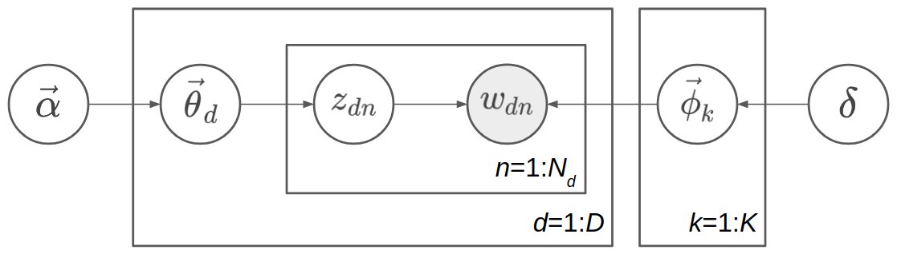
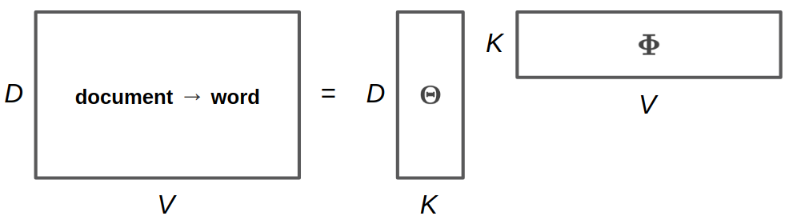
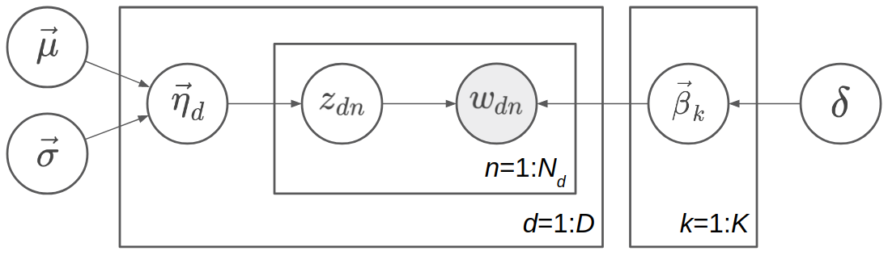

Logistic Normal Topic Models
============================

The full script for this tutorial is at `examples/topic_models/lntm_mcem.py
<https://github.com/thu-ml/zhusuan/blob/master/examples/topic_models/lntm_mcem.py>`_.

An introduction to topic models and Latent Dirichlet Allocation
---------------------------------------------------------------

Nowadays it is much easier to get large corpus of documents. Even if there are
no suitable labels with these documents, much information can be extracted. We
consider designing a probabilistic model to generate the documents. Generative
models can bring more benefits than generating more data. One can also fit the
data under some specific structure through generative models. By inferring the
parameters in the model (either return a most probable value or figure out its
distribution), some valuable information may be discovered.

For example, we can model documents as arising from multiple topics, where a
topic is defined to be a distribution over a fixed vocabulary of terms. The most
famous model is **Latent Dirichlet Allocation** (LDA)
:cite:`lntm-blei2003latent`. First we describe the notations. Following
notations differ from the standard notations in two places for consistence with
our notations of LNTM: The topics is denoted :math:`\vec{\phi}` instead of
:math:`\vec{\beta}`, and the scalar Dirichlet prior of topics is :math:`\delta`
instead of :math:`\eta`. Suppose there are :math:`D` documents in the corpus,
and the :math:`d`\ th document has :math:`N_d` words. Let :math:`K` be a
specified number of topics, :math:`V` the size of vocabulary,
:math:`\vec{\alpha}` a positive :math:`K` dimension-vector, and :math:`\delta` a
positive scalar. Let :math:`\mathrm{Dir}_K(\vec{\alpha})` denote a
:math:`K`-dimensional Dirichlet with vector parameter :math:`\vec{\alpha}` and
:math:`\mathrm{Dir}_V(\delta)` denote a :math:`V`-dimensional Dirichlet with
scalar parameter :math:`\delta`. Let :math:`\mathrm{Catg}(\vec{p})` be a
categorical distribution with vector parameter
:math:`\vec{p}=(p_1,p_2,...,p_n)^T` (:math:`\sum_{i=1}^n p_i=1`) and support
:math:`\{1,2,...,n\}`.

.. note::

    In fields such as machine learning and natural language processing, the
    categorical and multinomial distributions are conflated, and it is common to
    speak of a "multinomial distribution" when a "categorical distribution"
    would be more precise. By the way, these two distributions are distinguished
    clearly in ZhuSuan.

The generative process is:

.. math::

    \vec{\phi}_k &\sim \mathrm{Dir}_V(\delta), k=1,2,...,K \\
    \vec{\theta}_d &\sim \mathrm{Dir}_K(\vec{\alpha}), d=1,2,...,D \\
    z_{dn} &\sim \mathrm{Catg}(\vec{\theta}_d), d=1,2,...,D, n=1,2,...,N_d \\
    w_{dn} &\sim \mathrm{Catg}(\vec{\phi}_{z_{dn}}), d=1,2,...,D, n=1,2,...,N_d

In more detail, we first sample :math:`K` **topics**
:math:`\{\vec{\phi}_k\}_{k=1}^K` from the symmetric Dirichlet prior with
parameter :math:`\eta`, so each topic is a :math:`K`-dimensional vector, whose
components sum up to 1. These topics are shared among different documents. Then
for each document, suppose it is the :math:`d`\ th document, we sample a **topic
proportion** vector :math:`\vec{\theta}_d` from the Dirichlet prior with
parameter :math:`\vec{\alpha}`, indicating the topic proportion of this
document, such as 70% topic 1 and 30% topic 2. Next we start to sample the words
in the document. Sampling each word :math:`w_{dn}` is a two-step process: first,
sample the **topic assignment** :math:`z_{dn}` from the categorical distribution
with parameter :math:`\vec{\theta}_d`; secondly, sample the word :math:`w_{dn}`
from the categorical distribution with parameter :math:`\vec{\phi}_{z_{dn}}`.
The range of :math:`d` is :math:`1` to :math:`D`, and the range of :math:`n` is
:math:`1` to :math:`N_d` in the :math:`d`\ th document. The model is shown as a
directed graphical model in the following figure.

.. note::

    Topic :math:`\{\phi_k\}`, topic proportion :math:`\{\theta_d\}`, and topic
    assignment :math:`\{z_{dn}\}` have very different meaning. **Topic** means
    some distribution over the words in vocabulary. For example,a topic
    consisting of 10% "game", 5% "hockey", 3% "team", ..., possibly means a
    topic about sports. They are shared among different documents. A **topic
    proportion** belongs to a document, roughly indicating the probability
    distribution of topics in the document. A **topic assignment** belongs to a
    word in a document, indicating when sampling the word, which topic is
    sampled first, so the word is sampled from this assigned topic. Both topic,
    topic proportion, and topic assignment are latent variables which we have
    not observed. The only observed variable in the generative model is the
    words :math:`\{w_{dn}\}`, and what Bayesian inference needs to do is to
    infer the posterior distribution of topic :math:`\{\phi_k\}`, topic
    proportion :math:`\{\theta_d\}`, and topic assignment :math:`\{z_{dn}\}`.

The key property of LDA is conjugacy between the Dirichlet prior and likelihood.
We can write the joint probability distribution as follows:

.. math::

    p(w_{1:D,1:N}, z_{1:D,1:N}, \vec{\theta}_{1:D}, \vec{\phi}_{1:K};
    \vec{\alpha}, \delta) =
    \prod_{k=1}^K p(\vec{\phi}_k; \delta) \prod_{d=1}^D \{ p(\vec{\theta}_d;
    \vec{\alpha}) \prod_{n=1}^{N_d} [p(z_{dn}|\vec{\theta}_d) p(w_{dn}|z_{dn},
    \vec{\phi}_{1:K})] \}

Here :math:`p(y|x)` means conditional distribution in which :math:`x` is a
random variable, but :math:`p(y;x)` means distribution parameterized by
:math:`x`, while :math:`x` is a fixed value.

We denote :math:`\mathbf{\Theta}=(\vec{\theta}_1, \vec{\theta}_2, ...,
\vec{\theta}_D)^T`, :math:`\mathbf{\Phi}=(\vec{\phi}_1, \vec{\phi}_2, ...,
\vec{\phi}_K)^T`. Then :math:`\mathbf{\Theta}` is a :math:`D\times K` matrix
with each row representing topic proportion of one document, while
:math:`\mathbf{\Phi}` is a :math:`K\times V` matrix with each row representing a
topic. We also denote :math:`\mathbf{z}=z_{1:D,1:N}` and
:math:`\mathbf{w}=w_{1:D,1:N}` for convenience. 

Our goal is to do posterior inference from the joint distribution. Since there
are three sets of latent variables in the joint distribution:
:math:`\mathbf{\Theta}`, :math:`\mathbf{\Phi}` and :math:`\mathbf{z}`, inferring
their posterior distribution at the same time will be difficult, but we can
leverage the conjugacy between Dirichlet prior such as :math:`p(\vec{\theta}_d;
\vec{\alpha})` and the multinomial likelihood such as :math:`\prod_{n=1}^{N_d}
p(z_{dn}|\vec{\theta}_d)` (here the multinomial refers to a product of a bunch
of categorical distribution, i.e. ignore the normalizing factor of multinomial
distribution).

Two ways to leverage this conjugacy are:

(1) Iterate by fixing two sets of latent variables, and do conditional computing
for the remaining set. The examples are Gibbs sampling and mean-field
variational inference. For Gibbs sampling, each iterating step is fixing the
value of samples of two sets, and sample from the conditional distribution of
the remaining set. For mean-field variational inference, we often optimize by
coordinate ascent: each iterating step is fixing the variational distribution of
two sets, and updating the variational distribution of the remaining set based
on the parameters of the variational distribution of the two sets. Thanks to the
conjugacy, both conditional distribution in Gibbs sampling and conditional
update of the variational distribution in variational inference are tractable.

(2) Alternatively, we can integrate out some sets of latent variable before
doing further inference. For example, we can integrate out
:math:`\mathbf{\Theta}` and :math:`\mathbf{\Phi}`, remaining the joint
distribution :math:`p(\mathbf{w}, \mathbf{z}; \vec{\alpha}, \delta)` and do
Gibbs sampling or variational Bayes on :math:`\mathbf{z}`. After having a
estimation to :math:`\mathbf{z}`, we can extract some estimation about
:math:`\mathbf{\Phi}` as the topic information too. These methods are called
respectively collapsed Gibbs sampling, and collapsed variational Bayesian
inference.

However, conjugacy requires the model being designed carefully. Here, we use a
more direct and general method to do Bayesian inference: Monte-Carlo EM, with
HMC as the Monte-Carlo sampler.

Logistic Normal Topic Model in ZhuSuan
--------------------------------------

Integrating out :math:`\mathbf{\Theta}` and :math:`\mathbf{\Phi}` requires
conjugacy, or the integration is intractable. But integrating :math:`\mathbf{z}`
is always tractable since :math:`\mathbf{z}` is discrete. Now we have:

.. math::

    p(w_{dn}=v|\vec{\theta}_d, \Phi) = \sum_{k=1}^K (\vec{\theta}_d)_k \Phi_{kv}

More compactly,

.. math::

    p(w_{dn}|\vec{\theta}_d, \Phi) = \mathrm{Catg}(\Phi^T\vec{\theta}_d)

which means when sampling the words in the :math:`d`\ th document, the word
distribution is the weighted average of all topics, and the weights are the
topic proportion of the document.

In LDA we implicitly use the bag-of-words model, and here we make it explicit.
Let :math:`\vec{x}_d` be a :math:`V`-dimensional vector,
:math:`\vec{x}_d=\sum_{n=1}^{N_d}\mathrm{one\_hot}(w_{dn})`. That is, for :math:`v` from
:math:`1` to :math:`V`, :math:`(\vec{x}_d)_v` represents the occurence count of
the :math:`v`\ th word in the document. Denote :math:`\mathbf{X}=(\vec{x}_1,
\vec{x}_2, ..., \vec{x}_D)^T`, which is a :math:`D\times V` matrix. You can
verify the following concise formula:

.. math::

    \log p(\mathbf{X}|\mathbf{\Theta}, \mathbf{\Phi})=-\mathrm{CE}(\mathbf{X},
    \mathbf{\Theta}\mathbf{\Phi})

Here, CE means cross entropy, which is defined for matrices as
:math:`\mathrm{CE}(\mathbf{A},\mathbf{B})=-\sum_{i,j}A_{ij}\log B_{ij}`. Note
that :math:`p(\mathbf{X}|\mathbf{\Theta}, \mathbf{\Phi})` is not a proper
distribution; It is a convenient term representing the likelihood of parameters.
What we actually means is :math:`\log p(w_{1:D,1:N}|\mathbf{\Theta},
\mathbf{\Phi})=-\mathrm{CE}(\mathbf{X}, \mathbf{\Theta}\mathbf{\Phi})`.

A intuitive demonstration of :math:`\mathbf{\Theta}`, :math:`\mathbf{\Phi}` and
:math:`\mathbf{\Theta\Phi}` is shown in the following picture.
:math:`\mathbf{\Theta}` is the document-topic matrix, :math:`\mathbf{\Phi}` is
the topic-word matrix, and then :math:`\mathbf{\Theta\Phi}` is the document-word
matrix, which contains the word sampling distribution of each document.

As minimizing the cross entropy encourages :math:`\mathbf{X}` and
:math:`\mathbf{\Theta}\mathbf{\Phi}` to be similar, this may reminds you of
low-rank matrix factorization. It is natural since topic models can be
interpreted as learning "document-topics" parameters and "topic-words"
parameters. In fact one of the earliest topic models are solved using SVD, a
standard algorithm for low-rank matrix factorization. However, as a
probabilistic model, our model is different than matrix factorization by SVD
(e.g. the loss function is different). Probabilistic model has more
interpretability and can be solved using more algorithms, and Bayesian model can
bring the benefits of incorporating prior knowledge and inferring with
uncertainty.

After integrating :math:`\mathbf{z}`, only :math:`\mathbf{\Theta}` and
:math:`\mathbf{\Phi}` are left, and there is no conjugacy any more. Even if we
apply the "conditional computing" trick like Gibbs sampling, no closed-form
updating process can be obtained. However, we can adopt the gradient-based
method such as HMC and gradient ascent. Note that each row of
:math:`\mathbf{\Theta}` and :math:`\mathbf{\Phi}` lies on a probability simplex,
which is bounded and embedded. It is not common for HMC or gradient ascent to
deal with constrained sampling or constrained optimzation. Since we do not nead
conjugacy now, we replace the Dirichlet prior with **logistic normal** prior.
Now the latent variables live in the whole space :math:`\mathbb{R}^n`.

One may ask why to integrate the parameters :math:`\mathbf{z}` and lose the
conjugacy. That is because our inference technique can also apply to other
models which do not have conjugacy from the beginning, such as Neural
Variational Document Model (:cite:`lntm-miao2016neural`).

The logistic normal topic model can be described as follows, where
:math:`\{\vec{0}, \delta^2 \mathbf{I}\}` is a :math:`V`-dimensional mean
vector and covariance matrix, and :math:`\vec{\mu}` and :math:`\vec{\sigma}` are
:math:`K`-dimensional vectors:

.. math::

    \vec{\beta}_k &\sim \mathcal{N}(\vec{0}, \delta^2 \mathbf{I}), k=1,2,...,K \\
    \vec{\phi}_k &= \mathrm{softmax}(\vec{\beta}_k), k=1,2,...,K \\
    \vec{\eta}_d &\sim \mathcal{N}(\vec{\mu}, \mathrm{diag}(\vec{\sigma}^2)), d=1,2,...,D \\
    \vec{\theta}_d &= \mathrm{softmax}(\vec{\eta}_d), d=1,2,...,D \\
    z_{dn} &\sim \mathrm{Catg}(\vec{\theta}_d), d=1,2,...,D, n=1,2,...,N_d \\
    w_{dn} &\sim \mathrm{Catg}(\vec{\phi}_{z_{dn}}), d=1,2,...,D, n=1,2,...,N_d

The graphical model representation is shown in the following figure.

Since :math:`\vec{\theta}_d` is a deterministic function of
:math:`\vec{\eta}_d`, we can omit one of them in the probabilistic graphical
model representation. Here :math:`\vec{\theta}_d` is omitted because
:math:`\vec{\eta}_d` has a simpler prior. Similarly, we omit
:math:`\vec{\phi}_k` and keep :math:`\vec{\beta}_k`.

.. note::

    Called *Logistic Normal Topic Model*, maybe this reminds you of correlated
    topic models. However, in our model the normal prior of :math:`\vec{\eta}_d`
    has a diagonal covariance matrix :math:`\mathrm{diag}(\vec{\sigma}^2)`, so
    it cannot model the correlations between different topics in the corpus.
    However, logistic normal distribution can approximate Dirichlet distribution
    (see :cite:`lntm-srivastava2017autoencoding`). Hence our model is roughly
    the same as LDA, while the inference techniques are different.

We denote :math:`\mathbf{H}=(\vec{\eta}_1, \vec{\eta}_2, ..., \vec{\eta}_D)^T`,
:math:`\mathbf{B}=(\vec{\beta}_1, \vec{\beta}_2, ..., \vec{\beta}_K)^T`. Then
:math:`\mathbf{\Theta}=\mathrm{softmax}(\mathbf{H})`, and
:math:`\mathbf{\Phi}=\mathrm{softmax}(\mathbf{B})`. Recall our notation that
:math:`\mathbf{X}=(\vec{x}_1, \vec{x}_2, ..., \vec{x}_D)^T` where
:math:`\vec{x}_d=\sum_{n=1}^{N_d}\mathrm{one\_hot}(w_{dn})`. After integrating
:math:`\{z_{dn}\}`, the last two lines of the generating process:

.. math::

    z_{dn} \sim \mathrm{Catg}(\vec{\theta}_d), w_{dn} \sim
    \mathrm{Catg}(\vec{\phi}_{z_{dn}})

become :math:`\log p(\mathbf{X}|\mathbf{\Theta},
\mathbf{\Phi})=-\mathrm{CE}(\mathbf{X}, \mathbf{\Theta}\mathbf{\Phi})`. So we
can write the joint probability distribution as follows:

.. math::

    p(\mathbf{X}, \mathbf{H}, \mathbf{B}; \vec{\mu}, \vec{\sigma}, \delta) =
    p(\mathbf{B}; \delta) p(\mathbf{H}; \vec{\mu}, \vec{\sigma})
    p(\mathbf{X}|\mathbf{H}, \mathbf{B})

where both :math:`p(\mathbf{B}; \delta)` and :math:`p(\mathbf{H}; \vec{\mu},
\vec{\sigma})` are Gaussian distribution and
:math:`p(\mathbf{X}|\mathbf{H}, \mathbf{B})=-\mathrm{CE}(\mathbf{X},
\mathrm{softmax}(\mathbf{H})\mathrm{softmax}(\mathbf{B}))`.

In ZhuSuan, the code for constructing such a model is::

    def lntm(observed, n_chains, n_docs, n_topics, n_vocab, eta_mean, eta_logstd):
        with zs.BayesianNet(observed=observed) as model:
            eta_mean = tf.tile(tf.expand_dims(
                            tf.tile(tf.expand_dims(eta_mean, 0), [n_docs, 1]),
                            0), [n_chains, 1, 1])
            # eta/theta: Unnormalized/normalized document-topic matrix
            eta = zs.Normal('eta', eta_mean, logstd=eta_logstd, group_ndims=1)
            theta = tf.nn.softmax(eta)
            # beta/phi: Unnormalized/normalized topic-word matrix
            beta = zs.Normal('beta', tf.zeros([n_topics, n_vocab]),
                            logstd=log_delta, group_ndims=1)
            phi = tf.nn.softmax(beta)
            # doc_word: Document-word matrix
            doc_word = tf.matmul(tf.reshape(theta, [-1, n_topics]), phi)
            doc_word = tf.reshape(doc_word, [n_chains, n_docs, n_vocab])
            x = zs.UnnormalizedMultinomial('x', tf.log(doc_word),
                                        normalize_logits=False,
                                        dtype=tf.float32)
        return model

where ``eta_mean`` is :math:`\vec{\mu}`, ``eta_logstd`` is :math:`\log\vec{\sigma}`,
``eta`` is :math:`\mathbf{H}` (:math:`\mathrm{H}` is the uppercase letter of
:math:`\mathrm{\eta}`), ``theta`` is
:math:`\mathbf{\Theta}=\mathrm{softmax}(\mathbf{H})`, ``beta`` is :math:`\mathbf{B}`
(:math:`\mathrm{B}` is the uppercase letter of :math:`\mathrm{\beta}`), ``phi``
is :math:`\mathbf{\Phi}=\mathrm{softmax}(\mathbf{B})`, ``doc_word`` is
:math:`\mathbf{\Theta}\mathbf{\Phi}`, ``x`` is :math:`\mathbf{X}`.

Q: What does ``UnnormalizedMultinomial`` distribution means?

A: ``UnnormalizedMultinomial`` distribution is not a proper distribution. It
means the likelihood of "bags of categorical". To understand this, let's
talk about multinomial distribution first. Suppose there are :math:`k` events
:math:`\{1,2,...,k\}` with the probabilities :math:`p_1,p_2,...,p_k`, and we do
:math:`n` trials, and the count of result being :math:`i` is :math:`x_i`. Denote
:math:`\vec{x}=(x_1,x_2,...,x_k)^T` and :math:`\vec{p}=(p_1,p_2,...,p_k)^T`.
Then :math:`\vec{x}` follows multinomial distribution: :math:`p(\vec{x};
\vec{p})=\frac{n!}{x_1!...x_k!}p_1^{x_1}...p_k^{x_k}`, so :math:`\log p(\vec{x};
\vec{p})=\log\frac{n!}{x_1!...x_k!} - \mathrm{CE}(\vec{x},\vec{p})`. However,
when we want to optimize the parameter :math:`\vec{p}`, we do not care the first
term. On the other hand, if we have a *sequence* of results :math:`\vec{w}`, and
the result counts are summarized in :math:`\vec{x}`. Then :math:`\log p(\vec{w};
\vec{p})=-\mathrm{CE}(\vec{x},\vec{p})`. The normalizing constant also
disappears. Since sometimes we only have access to :math:`\vec{x}` instead of
the actual sequence of results, when we want to optimize w.r.t. the parameters,
we can write :math:`\vec{x}\sim \mathrm{UnnormalizedMultinomial}(\vec{p})`,
although it is not a proper distribution and we cannot sample from it.
``UnnormalizedMultinomial`` just means :math:`p(\vec{w};
\vec{p})=-\mathrm{CE}(\vec{x},\vec{p})`. In the example of topic models, the
situation is also like this.

Q: The shape of ``eta`` in the model is ``n_chains*n_docs*n_topics``. Why we
need the first dimension to store its different samples?

A: After introducing the inference method, we should know ``eta`` is a latent
variable which we need to integrate w.r.t. its distribution. In many cases the
integration is intractable, so we replace the integration with Monte-Carlo
methods, which requires the samples of the latent variable. Therefore we need to
construct our model, calculate the joint likelihood and do inference all with
the extra dimension storing different samples. In this example, the extra
dimension is called "chains" because we initialize multiple chains and perform
HMC evolution on each chain, so as to make the values on these chains close to
following the posterior distribution.

Inference
---------

Let's analyze the parameters and latent variables in the joint distribution.
:math:`\delta` controls the sparsity of the words included in each topic, and
larger :math:`\delta` leads to more sparsity. We leave it as a given
controllable hyperparameter without the need to optimize. The parameters we need
to optimize is :math:`\vec{\mu}` and :math:`\vec{\sigma}^2`, whose element
represents the mean and variance of topic proportion in documents; and
:math:`\mathbf{B}`, which represents the topics. For :math:`\vec{\mu}` and
:math:`\vec{\sigma}`, we want to find their **maximum likelihood (MLE)**
solution. Unlike :math:`\vec{\mu}` and :math:`\vec{\sigma}`, :math:`\mathbf{B}`
has a prior, so we could treat it as a random variable and infer its posterior
distribution. But here we just find its **maximum a posterior (MAP)**
estimation, so we treat it as a parameter and optimize it by gradient ascent
instead of inference via HMC. :math:`\mathbf{H}` is the latent variable which
has a prior distribution, so we want to integrate it out before doing
optimization.

Therefore, after integrating :math:`\mathbf{H}`, our optimization problem is:

.. math::

    \max_{\mathbf{B}, \vec{\mu}, \vec{\sigma}}\ \log p(\mathbf{X}, \mathbf{B};
    \vec{\mu}, \vec{\sigma}, \delta)

where

.. math::

    \log p(\mathbf{X}, \mathbf{B}; \vec{\mu}, \vec{\sigma}, \delta) &= \log
    p(\mathbf{X}| \mathbf{B}; \vec{\mu}, \vec{\sigma})
    + \log p(\mathbf{B}; \delta) \\ 
    &= \log \int_{\mathbf{H}} p(\mathbf{X}, \mathbf{H}| \mathbf{B}; \vec{\mu},
    \vec{\sigma}) d\mathbf{H} + \log p(\mathbf{B}; \delta)

The term :math:`\log p(\mathbf{X}| \mathbf{B}; \vec{\mu}, \vec{\sigma}) = \log
\int_{\mathbf{H}} p(\mathbf{X}, \mathbf{H}| \mathbf{B}; \vec{\mu}, \vec{\sigma})
d\mathbf{H}` is **evidence** of the observed data :math:`\mathbf{X}`, given the
model with parameters :math:`\mathbf{B}`, :math:`\vec{\mu}`,
:math:`\vec{\sigma}`. Computing the integration is intractable, let alone
maximize it w.r.t. the parameters. Fortunately, this is the standard form to
which we can write an lower bound called **evidence lower bound (ELBO)**:

.. math::

    \log p(\mathbf{X}| \mathbf{B}; \vec{\mu}, \vec{\sigma}) &\geq \log
    p(\mathbf{X}| \mathbf{B}; \vec{\mu}, \vec{\sigma}) -
    \mathrm{KL}(q(\mathbf{H})||p(\mathbf{H}|\mathbf{X},\mathbf{B}; \vec{\mu},
    \vec{\sigma})) \\
    &= \mathbb{E}_{q(\mathbf{H})}[\log p(\mathbf{X}, \mathbf{H}| \mathbf{B};
    \vec{\mu}, \vec{\sigma}) - \log q(\mathbf{H})] \\
    &= \mathcal{L}(q, \mathbf{B}, \vec{\mu}, \vec{\sigma})

Therefore,

.. math::

    \log p(\mathbf{X}, \mathbf{B}; \vec{\mu}, \vec{\sigma}, \delta) \geq
    \mathcal{L}(q, \mathbf{B}, \vec{\mu}, \vec{\sigma}) + \log p(\mathbf{B};
    \delta)

When :math:`q(\mathbf{H})=p(\mathbf{H}|\mathbf{X},\mathbf{B}; \vec{\mu},
\vec{\sigma})`, the lower bound is tight. To do optimization, we can do
coordinate ascent to the lower bound, i.e. **expectation-maximization (EM)**
algorithm: We iterate between E-step and M-step.

In E-step, let 

.. math::

    q(\mathbf{H})\leftarrow\max_q \mathcal{L}(q, \mathbf{B}, \vec{\mu},
    \vec{\sigma})=p(\mathbf{H}|\mathbf{X},\mathbf{B}; \vec{\mu}, \vec{\sigma})

In M-step, let

.. math::

    \mathbf{B}, \vec{\mu},\vec{\sigma}&\leftarrow \max_{\mathbf{B},
    \vec{\mu},\vec{\sigma}} [\mathcal{L}(q, \mathbf{B}, \vec{\mu}, \vec{\sigma})
    + \log p(\mathbf{B}; \delta)] \\ &=\max_{\mathbf{B}, \vec{\mu},\vec{\sigma}}
    \{\mathbb{E}_{q(\mathbf{H})}[\log p(\mathbf{X}, \mathbf{H}| \mathbf{B};
    \vec{\mu}, \vec{\sigma})] + \log p(\mathbf{B}; \delta)\}

However, both the posterior :math:`p(\mathbf{H}|\mathbf{X},\mathbf{B};
\vec{\mu}, \vec{\sigma})` in the E step and the integration
:math:`\mathbb{E}_{q(\mathbf{H})}[\log p(\mathbf{X}, \mathbf{H}| \mathbf{B};
\vec{\mu}, \vec{\sigma})]` in the M step are intractable. It seems that we turn
an intractable problem into another intractable problem.

We have solutions. Since the difficulty lies in calculating and using the
posterior, we can use the whole set of tools in Bayesian inference. Here we use
sampling methods, to draw a series of samples :math:`\mathbf{H}^{(1)},
\mathbf{H}^{(2)}, ..., \mathbf{H}^{(S)}` from
:math:`p(\mathbf{H}|\mathbf{X},\mathbf{B}; \vec{\mu}, \vec{\sigma})`. Then we
let :math:`q(\mathbf{H})` be the empirical distribution of these samples, as an
approximation to the true posterior. Then the M-step becomes:

.. math::

    \mathbf{B}, \vec{\mu},\vec{\sigma}&\leftarrow \max_{\mathbf{B},
    \vec{\mu},\vec{\sigma}} [\mathbb{E}_{q(\mathbf{H})}[\log p(\mathbf{X},
    \mathbf{H}| \mathbf{B}; \vec{\mu}, \vec{\sigma})] + \log p(\mathbf{B};
    \delta)] \\ &= \max_{\mathbf{B}, \vec{\mu},\vec{\sigma}}
    [\frac{1}{S}\sum_{s=1}^S \log p(\mathbf{X}, \mathbf{H}^{(s)}| \mathbf{B};
    \vec{\mu}, \vec{\sigma}) + \log p(\mathbf{B}; \delta)]

Now the objective function is tractable to compute. This variant of EM algorithm
is called **Monte-Carlo EM**.

We analyze the E-step and M-step in more detail. What sampling method should we
choose in E-step? One of the workhorse sampling methods is **Hamiltonian Monte
Carlo (HMC)**. Unlike Gibbs sampling which need to derive the conditional
distribution, HMC is a black-box method which only requires access to the
gradient of log joint distribution at any position, which is almost always
tractable as long as the model is differentiable and the latent variable is
unconstrained. You do not need to have much knowledge about how HMC works when
using ZhuSuan's HMC functionality, but could refer to :cite:`lntm-neal2011mcmc`
if you are interested.

To use HMC in ZhuSuan, first define the HMC object and its parameters::

    hmc = zs.HMC(step_size=1e-3, n_leapfrogs=20, adapt_step_size=True,
                 target_acceptance_rate=0.6)

Then write the log joint probability :math:`\log p(\mathbf{X},\mathbf{H}|
\mathbf{B}; \vec{\mu}, \vec{\sigma})= \log p(\mathbf{X}| \mathbf{B},\mathbf{H})
+ p(\mathbf{H};\vec{\mu}, \vec{\sigma})`::

    def e_obj(observed, n_chains, n_docs):
        model = lntm(observed, n_chains, n_docs, n_topics, n_vocab,
                     eta_mean, eta_logstd)
        return model.local_log_prob('eta') + model.local_log_prob('x')

Given the following defined tensor::

    x = tf.placeholder(tf.float32, shape=[batch_size, n_vocab], name='x')
    eta = tf.Variable(tf.zeros([n_chains, batch_size, n_topics]), name='eta')
    beta = tf.Variable(tf.zeros([n_topics, n_vocab]), name='beta')

We can define the sampling operator of HMC::

    sample_op, hmc_info = hmc.sample(partial(e_obj, n_chains=n_chains,
                                             n_docs=batch_size),
                                     observed={'x': x, 'beta': beta},
                                     latent={'eta': eta})

When running the session, we can run ``sample_op`` to update the value of
``eta``. Note that the first parameter of ``hmc.sample`` should be a function
accepting ``observed`` (which is a Python dictionary) as its parameter and
returning the log joint probability p( observed, latent | parameters ).
``hmc_info`` is a struct containing information about the sampling iteration
executed by ``sample_op``, such as the acceptance rate.

In the M-step, since :math:`\log p(\mathbf{X},\mathbf{H}| \mathbf{B}; \vec{\mu},
\vec{\sigma})= \log p(\mathbf{X}| \mathbf{B},\mathbf{H}) +
p(\mathbf{H};\vec{\mu}, \vec{\sigma})`, we can write the updating formula in
more detail:

.. math::

    \vec{\mu}, \vec{\sigma}&\leftarrow  \max_{ \vec{\mu},\vec{\sigma}}
    [\frac{1}{S}\sum_{s=1}^S \log p( \mathbf{H}^{(s)};\vec{\mu}, \vec{\sigma})]
    \\ \mathbf{B}&\leftarrow \max_{\mathbf{B}} [\frac{1}{S}\sum_{s=1}^S \log
    p(\mathbf{X}|\mathbf{H}^{(s)}, \mathbf{B}) + \log p(\mathbf{B}; \delta)]

Then the solution of :math:`\vec{\mu}` and :math:`\vec{\sigma}` have closed
formula by taking the samples of :math:`\mathbf{H}` as observed data and do
maximum likelihood estimation of parameters in Gaussian distribution.
:math:`\mathbf{B}`, however, does not have a closed-form solution, so we do
optimization using gradient ascent.

The gradient ascent operator of :math:`\mathbf{B}` can be defined as follows::

    model = lntm({'x': x, 'eta': eta, 'beta': beta}, n_chains, batch_size,
                 n_topics, n_vocab, eta_mean, eta_logstd)
    log_p_beta, log_px = model.local_log_prob(['beta', 'x'])
    log_likelihood = tf.reduce_sum(tf.reduce_mean(log_px, axis=0))
    log_joint = tf.reduce_sum(log_p_beta) + log_likelihood
    learning_rate_ph = tf.placeholder(tf.float32, shape=[], name='lr')
    optimizer = tf.train.AdamOptimizer(learning_rate_ph)
    infer = optimizer.minimize(-log_joint, var_list=[beta])

Since when optimizing :math:`\mathbf{B}`, the samples of :math:`\mathbf{H}` is
fixed, ``var_list=[beta]`` in the last line is a necessary.

In the E-step, :math:`p(\mathbf{H}|\mathbf{X},\mathbf{B}; \vec{\mu},
\vec{\sigma})` could factorise as :math:`\prod_{d=1}^D
p(\vec{\eta}_d|\vec{x}_d,\mathbf{B}; \vec{\mu}, \vec{\sigma})`, so we can do
sampling for a mini-batch of data given some value of global parameters
:math:`\mathbf{B}`, :math:`\vec{\mu}`, and :math:`\vec{\sigma}`. Since the
update of :math:`\mathbf{B}` requires calculating gradients and has a relatively
large time cost, we use stochastic gradient ascent to optimize it. That is,
after a mini-batch of latent variables are sampled, we do a step of gradient
ascent as M-step for :math:`\mathbf{B}` using the mini-batch chosen in the
E-step.

Now we have both the sampling operator for the latent variable ``eta`` and
optimizing operator for the parameter ``beta``, while the optimization w.r.t.
``eta_mean`` and ``eta_logstd`` is straightforward. Now we can run the EM
algorithm.

First, the definition is as follows::

    iters = X_train.shape[0] // batch_size
    Eta = np.zeros((n_chains, X_train.shape[0], n_topics), dtype=np.float32)
    Eta_mean = np.zeros(n_topics, dtype=np.float32)
    Eta_logstd = np.zeros(n_topics, dtype=np.float32)

    eta_mean = tf.placeholder(tf.float32, shape=[n_topics], name='eta_mean')
    eta_logstd = tf.placeholder(tf.float32, shape=[n_topics],
                                name='eta_logstd')
    eta_ph = tf.placeholder(tf.float32, shape=[n_chains, batch_size, n_topics],
                            name='eta_ph')
    init_eta_ph = tf.assign(eta, eta_ph)

The key code in an epoch is::

    time_epoch = -time.time()
    lls = []
    accs = []
    for t in range(iters):
        x_batch = X_train[t*batch_size: (t+1)*batch_size]
        old_eta = Eta[:, t*batch_size: (t+1)*batch_size, :]

        # E step
        sess.run(init_eta_ph, feed_dict={eta_ph: old_eta})
        for j in range(num_e_steps):
            _, new_eta, acc = sess.run(
                [sample_op, hmc_info.samples['eta'],
                 hmc_info.acceptance_rate],
                feed_dict={x: x_batch,
                           eta_mean: Eta_mean,
                           eta_logstd: Eta_logstd})
            accs.append(acc)
            # Store eta for the persistent chain
            if j + 1 == num_e_steps:
                Eta[:, t*batch_size: (t+1)*batch_size, :] = new_eta

        # M step
        _, ll = sess.run(
            [infer, log_likelihood],
            feed_dict={x: x_batch,
                       eta_mean: Eta_mean,
                       eta_logstd: Eta_logstd,
                       learning_rate_ph: learning_rate * t0 / (
                           t0 + epoch)})
        lls.append(ll)

    # Update hyper-parameters
    Eta_mean = np.mean(Eta, axis=(0, 1))
    Eta_logstd = np.log(np.std(Eta, axis=(0, 1)) + 1e-6)

    time_epoch += time.time()
    print('Epoch {} ({:.1f}s): Perplexity = {:.2f}, acc = {:.3f}, '
          'eta mean = {:.2f}, logstd = {:.2f}'
          .format(epoch, time_epoch,
                  np.exp(-np.sum(lls) / np.sum(X_train)),
                  np.mean(accs), np.mean(Eta_mean),
                  np.mean(Eta_logstd)))

We run ``num_e_steps`` times of E-step before M-step to make samples of HMC more
close to following the desired equilibrium distribution. Outputing the mean
acceptance rate of HMC is because it could help us diagnose whether HMC is
working properly. If it is too close to 0 or 1, the quality of samples will
often be poor. Moreover, when HMC works properly, we can also tune the
acceptance rate to a value for better performance, and the value is usually
between 0.6 and 0.9. In the example we set ``adapt_step_size=True`` and
``target_acceptance_rate=0.6`` to HMC, so the outputs of actual acceptance rates
should be close to 0.6.

Finally we can output the optimized value of ``phi`` = softmax(``beta``),
``eta_mean`` and ``eta_logstd`` to show the learned topics and their proportion
in the documents of the corpus::

    p = sess.run(phi)
    for k in range(n_topics):
        rank = zip(list(p[k, :]), range(n_vocab))
        rank.sort()
        rank.reverse()
        sys.stdout.write('Topic {}, eta mean = {:.2f} stdev = {:.2f}: '
                         .format(k, Eta_mean[k], np.exp(Eta_logstd[k])))
        for i in range(10):
            sys.stdout.write(vocab[rank[i][1]] + ' ')
        sys.stdout.write('\n')

Evaluation
----------

The ``log_likelihood`` used to calculate the perplexity may be confusing.
Typically, the "likelihood" should refer to the evidence of the observed data
given some parameter value, i.e. :math:`p(\mathbf{X}| \mathbf{B}; \vec{\mu},
\vec{\sigma})`, with the latent variable :math:`\mathbf{H}` integrated. However,
it is even more difficult to compute the marginal likelihood than to do
posterior inference. In the code, the likelihood is actually
:math:`p(\mathbf{X}|\mathbf{H}, \mathbf{B})`, which is not the marginal
likelihood; we should integrate it w.r.t. the prior of :math:`\mathbf{H}` to get
marginal likelihood. Hence the perplexity output during the training process
will be smaller than the actual value.

After training the model and outputing the topics, the script will run
**Annealed Importance Sampling (AIS)** to estimate the marginal likelihood more
accurately. It may take some time, and you could turn on the verbose mode of AIS
to see its progress. Then our script will output the estimated relatively
reliable perplexity. We do not introduce AIS here, readers who are interested
could refer to :cite:`lntm-neal2001annealed`.

.. bibliography:: ../refs.bib
    :style: unsrtalpha
    :labelprefix: LNTM
    :keyprefix: lntm-
