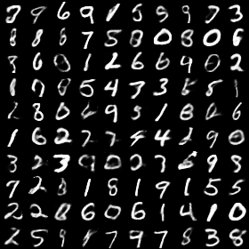

Variational Autoencoders
========================

**Variational Auto-Encoders** (VAE) :cite:`vae-kingma2013auto` is one of the
most widely used deep generative models.
In this tutorial, we show how to implement VAE in ZhuSuan step by step.
The full script is at
`examples/variational_autoencoders/vae.py <https://github.com/thu-ml/zhusuan/blob/master/examples/variational_autoencoders/vae.py>`_.

The generative process of a VAE for modeling binarized
`MNIST <https://www.tensorflow.org/get_started/mnist/beginners>`_ data is as
follows:

.. math::

    z &\sim \mathrm{N}(z|0, I) \\
    x_{logits} &= f_{NN}(z) \\
    x &\sim \mathrm{Bernoulli}(x|\mathrm{sigmoid}(x_{logits}))

This generative process is a stereotype for deep generative models, which
starts with a latent representation (:math:`z`) sampled from a simple
distribution (such as standard Normal).
Then the samples are forwarded through a deep neural network (:math:`f_{NN}`)
to capture the complex generative process of high dimensional observations
such as images.
Finally, some noise is added to the output to get a tractable likelihood for
the model.
For binarized MNIST, the observation noise is chosen to be Bernoulli, with
its parameters output by the neural network.

Build the model
---------------

In ZhuSuan, a model is constructed using
:class:`~zhusuan.framework.bn.BayesianNet`, which describes a directed
graphical model, i.e., Bayesian networks.
The suggested practice is to wrap model construction into a function (
we shall see the meanings of these arguments soon)::

    import zhusuan as zs

    def build_gen(x_dim, z_dim, n, n_particles=1):
        bn = zs.BayesianNet()

Following the generative process, first we need a standard Normal
distribution to generate the latent representations (:math:`z`).
As presented in our graphical model, the data is generated in batches with
batch size ``n``, and for each data, the latent representation is of
dimension ``z_dim``.
So we add a stochastic node by ``bn.normal`` to generate samples of shape
``[n, z_dim]``::

    # z ~ N(z|0, I)
    z_mean = tf.zeros([n, z_dim])
    z = bn.normal("z", z_mean, std=1., group_ndims=1, n_samples=n_particles)

The method ``bn.normal`` is a helper function that creates a
:class:`~zhusuan.distributions.univariate.Normal` distribution and adds a
stochastic node that follows this distribution to the
:class:`~zhusuan.framework.bn.BayesianNet` instance.
The returned ``z`` is a :class:`~zhusuan.framework.bn.StochasticTensor`, which
is Tensor-like and can be mixed with Tensors and fed into almost any
Tensorflow primitives.

.. note::

    To learn more about :class:`~zhusuan.distributions.base.Distribution` and
    :class:`~zhusuan.framework.bn.BayesianNet`. Please refer to
    :doc:`/tutorials/concepts`.

The shape of ``z_mean`` is ``[n, z_dim]``, which means that
we have ``[n, z_dim]`` independent inputs fed into the univariate
:class:`~zhusuan.distributions.univariate.Normal` distribution.
Because the input parameters are allowed to
`broadcast <https://docs.scipy.org/doc/numpy-1.12.0/user/basics.broadcasting.html>`_
to match each other's shape, the standard deviation ``std`` is simply set to
1.
Thus the shape of samples and probabilities evaluated at this node should
be of shape ``[n, z_dim]``. However, what we want in modeling MNIST data, is a
batch of ``[n]`` independent events, with each one producing samples of ``z``
that is of shape ``[z_dim]``, which is the dimension of latent representations.
And the probabilities in every single event in the batch should be evaluated
together, so the shape of local probabilities should be ``[n]`` instead of
``[n, z_dim]``.
In ZhuSuan, the way to achieve this is by setting `group_ndims``, as we do
in the above model definition code.
To help understand this, several other examples can be found in :ref:`dist`.
``n_samples`` is the number of samples to generate.
It is None by default, in which case a single sample is generated
without adding a new dimension.

Then we build a neural network of two fully-connected layers with :math:`z` 
as the input, which is supposed to learn the complex transformation that
generates images from their latent representations::

    # x_logits = f_NN(z)
    h = tf.layers.dense(z, 500, activation=tf.nn.relu)
    h = tf.layers.dense(h, 500, activation=tf.nn.relu)
    x_logits = tf.layers.dense(h, x_dim)

Next, we add an observation distribution (noise) that follows the Bernoulli
distribution to get a tractable likelihood when evaluating the probability
of an image::

    # x ~ Bernoulli(x|sigmoid(x_logits))
    bn.bernoulli("x", x_logits, group_ndims=1)

.. note::

    The :class:`~zhusuan.distributions.univariate.Bernoulli` distribution
    accepts log-odds of probabilities instead of probabilities.
    This is designed for numeric stability reasons. Similar tricks are used in
    :class:`~zhusuan.distributions.univariate.Categorical` , which accepts
    log-probabilities instead of probabilities.

Putting together, the code for constructing a VAE is::

    def build_gen(x_dim, z_dim, n, n_particles=1):
        bn = zs.BayesianNet()
        z_mean = tf.zeros([n, z_dim])
        z = bn.normal("z", z_mean, std=1., group_ndims=1, n_samples=n_particles)
        h = tf.layers.dense(z, 500, activation=tf.nn.relu)
        h = tf.layers.dense(h, 500, activation=tf.nn.relu)
        x_logits = tf.layers.dense(h, x_dim)
        bn.bernoulli("x", x_logits, group_ndims=1)

Reuse the model
---------------

Unlike common deep learning models (MLP, CNN, etc.), which is for supervised
tasks, a key difficulty in designing programing primitives for generative
models is their inner reusability. This is because in a probabilistic
graphical model, a stochastic node can have two kinds of
states, **observed or not observed**. Consider the above case, if ``z`` is a
tensor sampled from the prior, how about when you meet the condition that ``z``
is observed? In common practice of tensorflow programming, one has to build
another computation graph from scratch and reuse the Variables (weights here).
If there are many stochastic nodes in the model, this process will be really
painful.

**ZhuSuan has a novel solution for this.** To observe any stochastic nodes,
pass a dictionary mapping of ``(name, Tensor)`` pairs when constructing
:class:`~zhusuan.framework.bn.BayesianNet`. This will assign observed values
to corresponding ``StochasticTensor`` s. For example, to observe
a batch of images ``x_batch``, write::

    bn = zs.BayesianNet(observed={'x': x_batch})

However, we usually need to pass different observations to the same :class:`~zhusuan.framework.bn.BayesianNet` 
more than once. To achieve this, ZhuSuan provides a new class called :class:`~zhusuan.framework.meta_bn.MetaBayesianNet` 
to represent the meta version of BayesianNet which can repeatly produce 
BayesianNet objects by accepting different observations. 
The recommended way to construct a MetaBayesianNet is by wrapping the function 
with an decorator (more details in :ref:`bayesian-net`)::

    @zs.meta_bayesian_net(scope="gen", reuse_variables=True)
    def build_gen(x_dim, z_dim, n, n_particles=1):
        ...
        return bn

.. note::

    The observation passed must have the same type and shape as the
    `StochasticTensor`.

so that we can observe stochastic nodes in this way::

    model = build_gen(x_dim, z_dim, n, n_particles)
    x_mean = model.observe()["x_mean"]

Each time the function is called, a different observation assignment can be
passed. One could also add a decorator to the function: ``@zs.reuse_variables(scope)`` 
to **reuse tensorflow variables** in this function. Then this function
will automatically create variables the first time they are called and reuse
them thereafter, as shown in the following code::

    @zs.reuse_variables(scope="q_net")
    def build_q_net(x, z_dim, n_z_per_x):
        ...
        return bn

Inference and learning
----------------------

Having built the model, the next step is to learn it from binarized MNIST
images. We conduct
`Maximum Likelihood <https://en.wikipedia.org/wiki/Maximum_likelihood_estimation>`_
learning, that is, we are going to maximize the log likelihood of data in our
model:

.. math::

    \max_{\theta} \log p_{\theta}(x)

where :math:`\theta` is the model parameter.

.. note::

    In this Variational Autoencoder, the model parameter is the network
    weights, in other words, it's the tensorflow variables created in the
    ``fully_connected`` layers.

However, the model we defined has not only the observation (:math:`x`) but
also latent representation (:math:`z`). This makes it hard for us to compute
:math:`p_{\theta}(x)`, which we call the marginal likelihood of :math:`x`,
because we only know the joint likelihood of the model:

.. math::

    p_{\theta}(x, z) = p(z)p_{\theta}(x|z)

while computing the marginal likelihood requires an integral over latent
representation, which is generally intractable:

.. math::

    p_{\theta}(x) = \int p_{\theta}(x, z)\;dz

The intractable integral problem is a fundamental challenge in learning latent
variable models like VAE. Fortunately, the machine learning society has
developed many approximate methods to address it. One of them is
`Variational Inference <https://en.wikipedia.org/wiki/Variational_Bayesian_methods>`_.
As the inner intuition is very simple, we briefly introduce it below.

Because directly optimizing :math:`\log p_{\theta}(x)` is infeasible, we choose
to optimize a lower bound of it. The lower bound is constructed as

.. math::

    \log p_{\theta}(x) &\geq \log p_{\theta}(x) - \mathrm{KL}(q_{\phi}(z|x)\|p_{\theta}(z|x)) \\
    &= \mathbb{E}_{q_{\phi}(z|x)} \left[\log p_{\theta}(x, z) - \log q_{\phi}(z|x)\right] \\
    &= \mathcal{L}(\theta, \phi)

where :math:`q_{\phi}(z|x)` is a user-specified distribution of :math:`z`
(called **variational posterior**) that is chosen to match the true posterior
:math:`p_{\theta}(z|x)`. The lower bound is equal to the marginal log
likelihood if and only if :math:`q_{\phi}(z|x) = p_{\theta}(z|x)`, when the
`Kullback–Leibler divergence <https://en.wikipedia.org/wiki/Kullback%E2%80%93Leibler_divergence>`_
between them (:math:`\mathrm{KL}(q_{\phi}(z|x)\|p_{\theta}(z|x))`) is zero.

.. note::

    In Bayesian Statistics, the process represented by the Bayes' rule

    .. math::

        p(z|x) = \frac{p(z)(x|z)}{p(x)}

    is called
    `Bayesian Inference <https://en.wikipedia.org/wiki/Bayesian_inference>`_,
    where :math:`p(z)` is called **prior**, :math:`p(x|z)` is the conditional
    likelihood, :math:`p(x)` is the marginal likelihood or **evidence**,
    :math:`p(z|x)` is called **posterior**.

This lower bound is usually called Evidence Lower Bound (ELBO). Note that the
only probabilities we need to evaluate in it is the joint likelihood and
the probability of the variational posterior.

In variational autoencoder, the variational posterior (:math:`q_{\phi}(z|x)`)
is also parameterized by a neural network (:math:`g`), which accepts input
:math:`x`, and outputs the mean and variance of a Normal distribution:

.. math::

    \mu_z(x;\phi), \log\sigma_z(x;\phi) = g_{NN}(x) \\

    q_{\phi}(z|x) = \mathrm{N}(z|\mu_z(x;\phi), \sigma^2_z(x;\phi))

In ZhuSuan, the variational posterior can also be defined as a
:class:`~zhusuan.framework.bn.BayesianNet` . The code for above definition is::

    @zs.reuse_variables(scope="q_net")
    def build_q_net(x, z_dim, n_z_per_x):
        bn = zs.BayesianNet()
        h = tf.layers.dense(tf.cast(x, tf.float32), 500, activation=tf.nn.relu)
        h = tf.layers.dense(h, 500, activation=tf.nn.relu)
        z_mean = tf.layers.dense(h, z_dim)
        z_logstd = tf.layers.dense(h, z_dim)
        bn.normal("z", z_mean, logstd=z_logstd, group_ndims=1, n_samples=n_z_per_x)
        return bn

There are many ways to optimize this lower bound. One of the easiest way is
to do
`stochastic gradient descent <https://en.wikipedia.org/wiki/Stochastic_gradient_descent>`_,
which is very common in deep learning literature. However, the gradient
computation here involves taking derivatives of an expectation, which
needs Monte Carlo estimation. This often induces large variance if not properly
handled.

Many solutions have been proposed to estimate the gradient of some
type of variational lower bound (ELBO or others) with relatively low variance.
To make this more automatic and easier to handle, ZhuSuan has wrapped them
all into :mod:`single functions <zhusuan.variational>`, which computes
the final objective (or surrogate cost) for users to directly take derivatives
on. This means that optimizing these objectives is equally optimizing the
corresponding variational lower bounds using the well-developed low-variance
estimator.

Here we are using the **Stochastic Gradient Variational Bayes** (SGVB)
estimator from the original paper of variational autoencoders
:cite:`vae-kingma2013auto`. This estimator takes benefits of a clever
reparameterization trick to greatly reduce the variance when estimating the
gradients of ELBO. In ZhuSuan, one can use this estimator by calling the method
:func:`~sgvb` of the output of :func:`~zhusuan.variational.exclusive_kl.elbo`.
The code for this part is::

    x = tf.cast(tf.less(tf.random_uniform(tf.shape(x_input)), x_input),
                tf.int32)
    n = tf.placeholder(tf.int32, shape=[], name="n")

    model = build_gen(x_dim, z_dim, n, n_particles)
    variational = build_q_net(x, z_dim, n_particles)

    lower_bound = zs.variational.elbo(
        model, {"x": x}, variational=variational, axis=0)
    cost = tf.reduce_mean(lower_bound.sgvb())
    lower_bound = tf.reduce_mean(lower_bound)

.. note::

    For readers who are interested, we provide a detailed explanation of the
    :func:`~sgvb` estimator used here, though this is not
    required for you to use ZhuSuan's variational functionality.

    The key of SGVB estimator is a reparameterization trick, i.e., they
    reparameterize the random variable
    :math:`z\sim q_{\phi}(z|x) = \mathrm{N}(z|\mu_z(x;\phi), \sigma^2_z(x;\phi))`,
    as

    .. math::

        z = z(\epsilon; x, \phi) = \epsilon \sigma_z(x;\phi) + \mu_z(x;\phi),\; \epsilon\sim \mathrm{N}(0, I)

    In this way, the expectation can be rewritten with respect to
    :math:`\epsilon`:

    .. math::

        \mathcal{L}(\phi, \theta) &=
        \mathbb{E}_{z\sim q_{\phi}(z|x)} \left[\log p_{\theta}(x, z) - \log q_{\phi}(z|x)\right] \\
        &= \mathbb{E}_{\epsilon\sim \mathrm{N}(0, I)} \left[\log p_{\theta}(x, z(\epsilon; x, \phi)) -
        \log q_{\phi}(z(\epsilon; x, \phi)|x)\right]

    Thus the gradients with variational parameters :math:`\phi` can be
    directly exchanged into the expectation, enabling an unbiased low-variance
    Monte Carlo estimator:

    .. math::

        \nabla_{\phi} L(\phi, \theta) &=
        \mathbb{E}_{\epsilon\sim \mathrm{N}(0, I)} \nabla_{\phi} \left[\log p_{\theta}(x, z(\epsilon; x, \phi)) -
        \log q_{\phi}(z(\epsilon; x, \phi)|x)\right] \\
        &\approx \frac{1}{k}\sum_{i=1}^k \nabla_{\phi} \left[\log p_{\theta}(x, z(\epsilon_i; x, \phi)) -
        \log q_{\phi}(z(\epsilon_i; x, \phi)|x)\right]

    where :math:`\epsilon_i \sim \mathrm{N}(0, I)`

Now that we have had the objective function, the next step is to do the
stochastic gradient descent. Tensorflow provides many advanced
`optimizers <https://www.tensorflow.org/api_guides/python/train>`_
that improves the plain SGD, among which Adam
:cite:`vae-kingma2014adam` is probably the most popular one in deep learning
society. Here we are going to use Tensorflow's Adam optimizer to do the
learning::

    optimizer = tf.train.AdamOptimizer(0.001)
    infer_op = optimizer.minimize(cost)

Generate images
---------------

What we've done above is to define and learn the model. To see how it
performs, we would like to let it generate some images in the learning process.
For the generating process, we remove the observation noise, i.e.,
the :class:`~zhusuan.distributions.univariate.Bernoulli` distribution. 
We do this by using the direct output of the nueral network (``x_logits``)::

    @zs.meta_bayesian_net(scope="gen", reuse_variables=True)
    def build_gen(x_dim, z_dim, n, n_particles=1):
        bn = zs.BayesianNet()
            ...
        x_logits = tf.layers.dense(h, x_dim)
            ...

Then we add a sigmoid function to it to get a "mean" image. 
After that, we use the function: ``output`` to provide the value ``x_mean``,
so that we can easily access it by using the function: ``observe``.
This is done by::

    @zs.meta_bayesian_net(scope="gen", reuse_variables=True)
    def build_gen(x_dim, z_dim, n, n_particles=1):
        bn = zs.BayesianNet()
            ...
        x_logits = tf.layers.dense(h, x_dim)
        bn.deterministic("x_mean", tf.sigmoid(x_logits))
            ...
    
    x_gen = tf.reshape(model.observe()["x_mean"], [-1, 28, 28, 1])

Run gradient descent
--------------------

Now, everything is good before a run. So we could just open the Tensorflow
session, run the training loop, print statistics, and write generated
images to disk. Keep watching them and have fun :)
::

    with tf.Session() as sess:
        sess.run(tf.global_variables_initializer())

        for epoch in range(1, epochs + 1):
            time_epoch = -time.time()
            np.random.shuffle(x_train)
            lbs = []
            for t in range(iters):
                x_batch = x_train[t * batch_size:(t + 1) * batch_size]
                _, lb = sess.run([infer_op, lower_bound],
                                 feed_dict={x_input: x_batch,
                                            n_particles: 1,
                                            n: batch_size})
                lbs.append(lb)
            time_epoch += time.time()
            print("Epoch {} ({:.1f}s): Lower bound = {}".format(
                epoch, time_epoch, np.mean(lbs)))

            if epoch % save_freq == 0:
                images = sess.run(x_gen, feed_dict={n: 100, n_particles: 1})
                name = os.path.join(result_path,
                                    "vae.epoch.{}.png".format(epoch))
                save_image_collections(images, name)

.. rubric:: References

.. bibliography:: ../refs.bib
    :style: unsrtalpha
    :labelprefix: VAE
    :keyprefix: vae-
